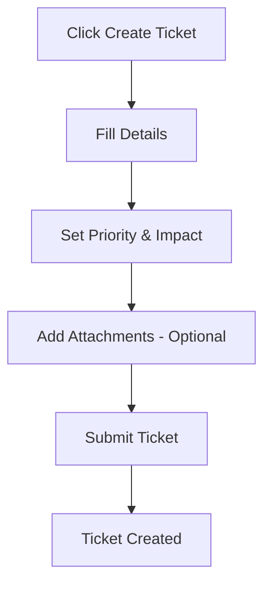
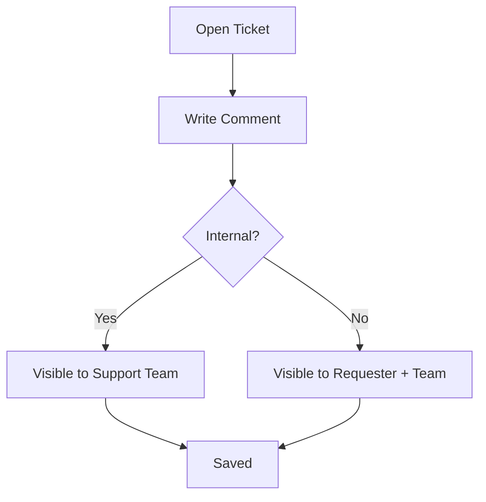
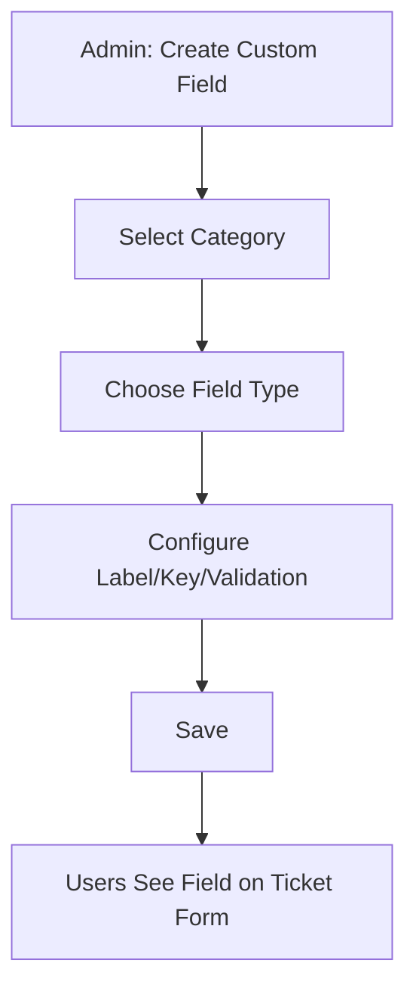
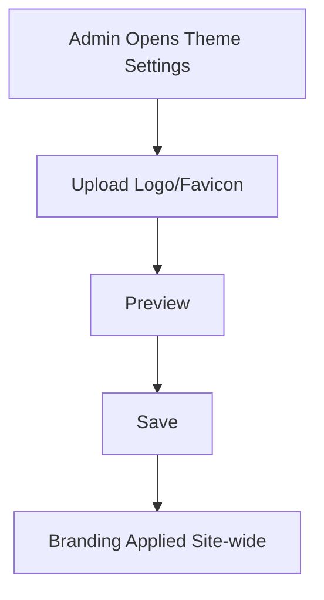
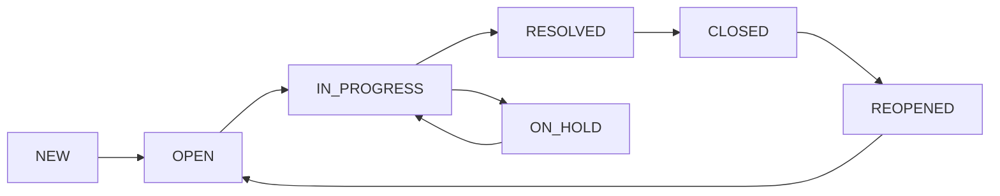
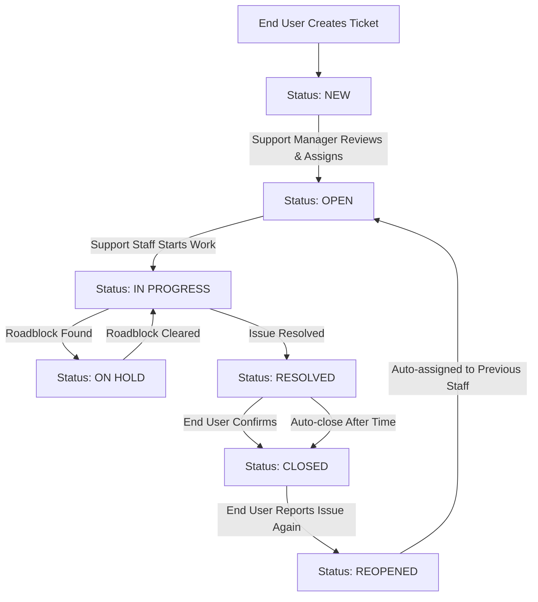
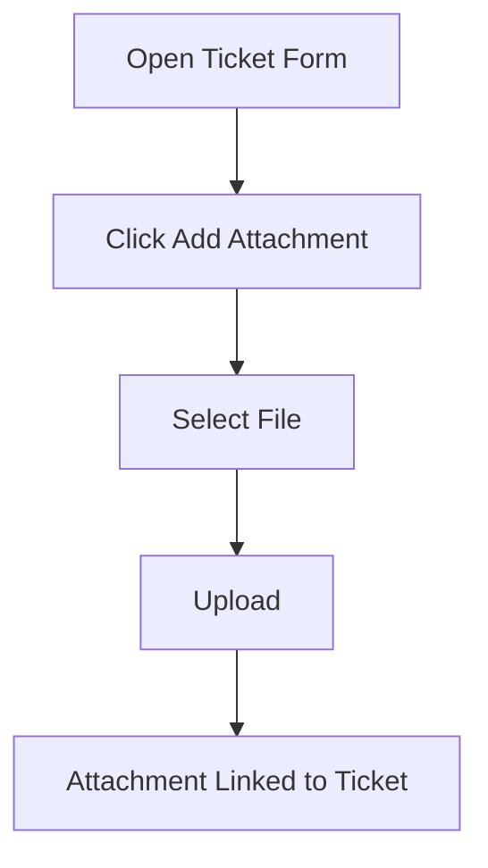
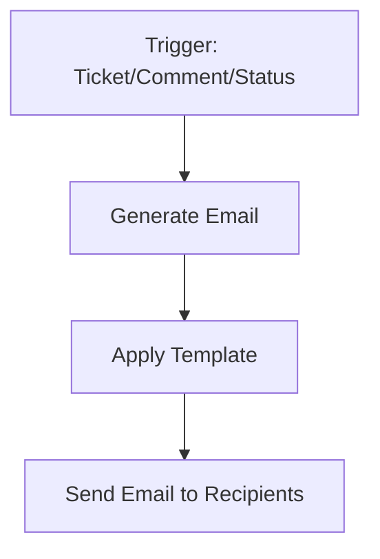
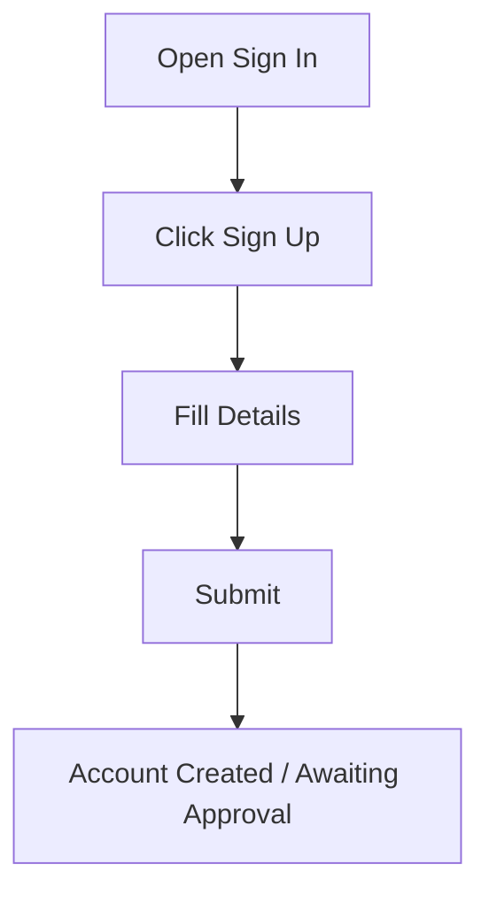

# NTG-Ticket User Guide

## Table of Contents
1. [Getting Started](#getting-started)
2. [Role Overview](#role-overview)
3. [Creating Tickets](#creating-tickets)
4. [Managing Tickets](#managing-tickets)
5. [Comments](#comments)
6. [Custom Fields](#custom-fields)
7. [Administration: Theme & Branding](#administration-theme--branding)
5. [Ticket Status Guide](#ticket-status-guide)
6. [Reports & Analytics](#reports--analytics)
7. [Coming Soon](#coming-soon)
7. [Quick Reference](#quick-reference)

---

## Getting Started

### Quick Start Guide
1. **Login** with your email and password
2. **Select your role** if you have multiple roles
3. **Create a ticket** (End Users) or **view assigned tickets** (Support Staff)
4. **Track progress** through status updates and comments

### What is NTG-Ticket?
A help desk system for reporting technical issues, tracking progress, and communicating with support staff.

---

## Role Overview

| Role | Can Do | Cannot Do | Access |
|------|--------|-----------|--------|
| **End User** | Create tickets, view own tickets, add comments, reopen closed tickets | Assign tickets, change status (except reopen), view other users' tickets | My Tickets, Reports |
| **Support Staff** | View assigned tickets, update status, add comments, resolve tickets | Assign tickets to others, view all tickets, manage users | Assigned Tickets, Reports |
| **Support Manager** | View all tickets, assign tickets, manage staff, view team performance | Manage users, system settings | All Tickets, Assigned Tickets, New Tickets, Reports |
| **Administrator** | Everything + manage users, system settings, view all data | None | All features + Administration panel |

---

## Creating Tickets

### Who Can Create Tickets
- **End Users**: Can create tickets
- **Other Roles**: Cannot create tickets (buttons hidden)

### How to Create a Ticket
1. Click **"Create Ticket"** button
2. Fill in:
   - **Title**: Brief problem description
   - **Description**: Detailed explanation
   - **Category**: Hardware, Software, Network, Access, Other
   - **Priority**: Low, Medium, High, Critical
   - **Impact**: Minor, Moderate, Major, Critical
3. Add attachments (optional)
4. Click **"Create Ticket"**

> Tip: Some categories will show additional fields (see [Custom Fields](#custom-fields)).

#### Screen

### Ticket Creation Flow

---

## Managing Tickets

### Viewing Tickets
- **End User**: "My Tickets" - only tickets you created
- **Support Staff**: "Assigned Tickets" - tickets assigned to you
- **Support Manager**: "All Tickets", "Assigned Tickets", "New Tickets"
- **Administrator**: "All Tickets" + administration features

### Ticket Actions by Role

| Action | End User | Support Staff | Manager | Admin |
|--------|----------|---------------|---------|-------|
| View Tickets | Own only | Assigned only | All | All |
| Edit Tickets | NEW status only | Assigned only | All | All |
| Update Status | Reopen only | Assigned only | All | All |
| Assign Tickets | No | No | Yes | Yes |
| Delete Tickets | No | No | Yes | Yes |

### Searching & Filtering
- **Search Bar**: Type keywords to find tickets
- **Advanced Search**: More detailed filters
- **Simple Filters**: Quick status, priority, category filters

#### Screen

---

## Comments

### Adding and Managing Comments
- Use the **Comments** panel on a ticket to add updates or ask questions.
- Toggle **Internal** if you want the comment visible only to support staff.
- Mention teammates with `@name` for clarity (if enabled).

#### Quick Steps
1. Open a ticket
2. Scroll to **Comments**
3. Type your message
4. Optional: toggle **Internal**
5. Click **Add Comment**

#### Screen

#### Comment Lifecycle

---

## Custom Fields

Custom fields let administrators extend the ticket form per category (e.g., Asset Tag for Hardware).

### How Users See Custom Fields
- When you choose a **Category**, any configured custom fields appear automatically.
- Supported types include text, number, boolean, select (varies by setup).

#### Screen

### Admin: Creating Custom Fields (Summary)
1. Go to **Administration › Custom Fields**
2. Click **Create Field**
3. Choose **Category** and **Field Type**
4. Set **Label**, **Key**, and **Validation**
5. Click **Save**

#### Flow

---

## Administration: Theme & Branding

### Theme Settings
- Navigate to **Administration › Theme Settings**
- Update the **Primary Color** to match your brand
- Changes apply across headers, buttons, and highlights

#### Screen

### Logo & Favicon
- In **Theme Settings**, upload your **Logo** (and optionally a **Favicon**)
- Supported formats: PNG, JPG, SVG (recommended: transparent background)
- After saving, the logo updates in the app header and login page

#### Flow

---

## Ticket Status Guide

### Status Meanings
| Status | Color | Meaning |
|--------|-------|---------|
| **NEW** | Blue | Just created, waiting for review |
| **OPEN** | Green | Support staff is working on it |
| **IN_PROGRESS** | Yellow | Actively being worked on |
| **ON_HOLD** | Orange | Paused (waiting for info/parts) |
| **RESOLVED** | Gray | Fixed, waiting for confirmation |
| **CLOSED** | Dark Gray | Completely finished |
| **REOPENED** | Purple | Problem came back |

### Status Flow

### Complete Ticket Lifecycle

### Who Can Change Status
- **End Users**: Can only reopen closed tickets
- **Support Staff**: Can change status of assigned tickets
- **Managers/Admins**: Can change status of any ticket

---

## Reports & Analytics

### Available Reports by Role

#### End User Reports
- **Summary Cards**: Total, Open, Resolved, Closed tickets
- **Filters**: Date range, status, priority, category, month-year
- **Export**: Excel format

#### Support Staff Reports
- **Summary Cards**: Assigned tickets, resolution time, SLA performance
- **Team Performance**: Personal metrics
- **Breakdown Tables**: By category, status, priority, impact, urgency

#### Support Manager Reports
- **Summary Cards**: All team metrics
- **Team Performance**: Staff performance metrics
- **Breakdown Tables**: All ticket breakdowns
- **SLA Performance**: Team SLA metrics

#### Administrator Reports
- **User Management**: User statistics, activity logs
- **System Analytics**: Login activity, audit trails
- **Security & Compliance**: Security events, system changes

### Exporting Reports
1. Set your filters
2. Click **"Export"** button
3. Choose Excel format
4. Download your report

#### Screen

---

## Coming Soon

These features are in final stages and may appear in your environment shortly. Usage will be as follows:

### Attachments
- Add files to tickets via **Attachments** section
- Supported: images, PDFs, docs (size limits may apply)

### Email Notifications
- Automatic emails for ticket created, status changes, and comments
- Admins can adjust templates in **Administration › Email Templates**

### User Signups
- Users will be able to self-register from the **Sign In** page when enabled

---

## Quick Reference

### Priority Levels
- 🟢 **LOW** - Can wait a few days
- 🟡 **MEDIUM** - 1-2 business days
- 🟠 **HIGH** - Needs attention today
- 🔴 **CRITICAL** - Emergency, immediate attention

### Common Actions by Role

| Role | Actions |
|------|---------|
| **End User** | Create tickets, View own tickets, Add comments, Reopen closed tickets, Export own ticket reports |
| **Support Staff** | View assigned tickets, Update ticket status, Add comments, Resolve tickets, Export assigned ticket reports |
| **Support Manager** | View all tickets, Assign tickets, Manage team performance, Export team reports, View new tickets requiring assignment |
| **Administrator** | All above actions, Manage users, System settings, View all system data, Export comprehensive reports |

### Navigation Menu by Role

| Role | Menu Items |
|------|------------|
| **End User** | My Tickets, Reports |
| **Support Staff** | Assigned Tickets, Reports |
| **Support Manager** | All Tickets, Assigned Tickets, New Tickets, Reports |
| **Administrator** | All Tickets, Assigned Tickets, New Tickets, Reports, Administration |

### Keyboard Shortcuts
- **Ctrl + L**: Open chat (if available)
- **Ctrl + K**: Quick search
- **Esc**: Close modals

---

*This guide covers the main features for all user roles in the NTG-Ticket system. For additional help, contact your system administrator.*
