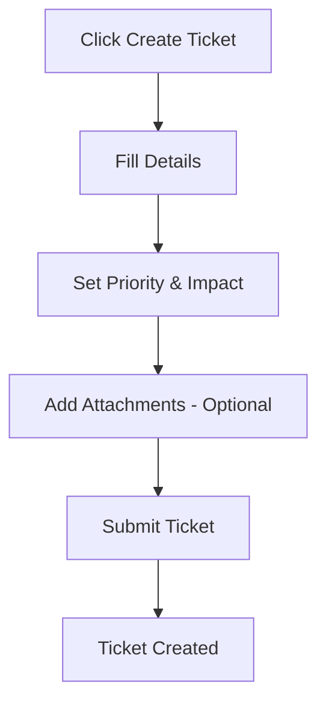
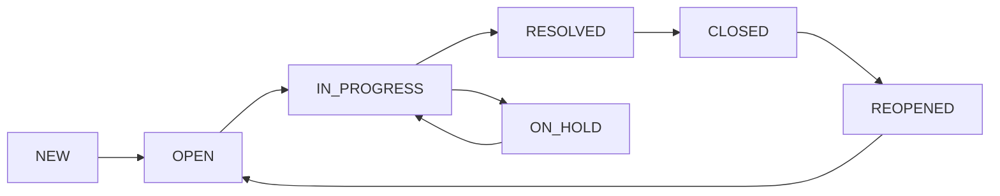
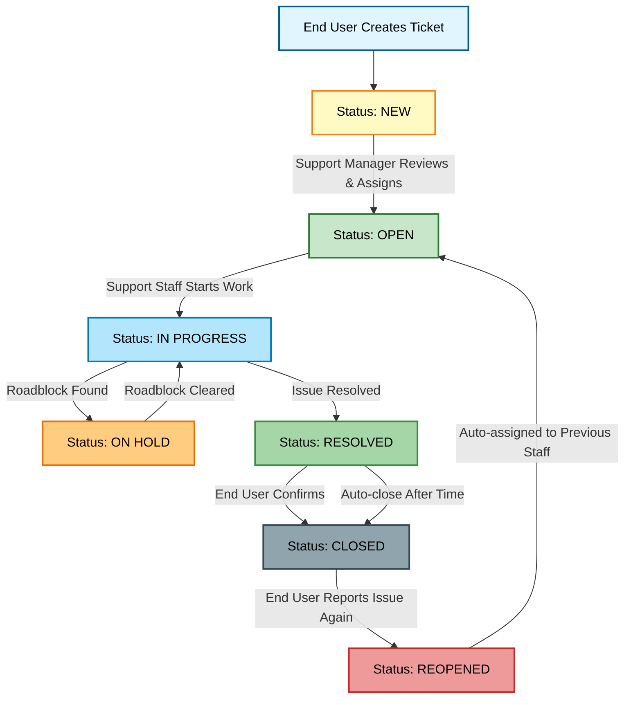

# NTG-Ticket User Guide

## Table of Contents
1. [Getting Started](#getting-started)
2. [Role Overview](#role-overview)
3. [Creating Tickets](#creating-tickets)
4. [Managing Tickets](#managing-tickets)
5. [Ticket Status Guide](#ticket-status-guide)
6. [Reports & Analytics](#reports--analytics)
7. [Quick Reference](#quick-reference)

---

## Getting Started

### What is NTG-Ticket?
A help desk system for reporting technical issues, tracking progress, and communicating with support staff.

### Login Process
1. Go to the NTG-Ticket website
2. Enter your email and password
3. If you have multiple roles, select your active role
4. Click "Continue"

---

## Role Overview

### End User
- **Can**: Create tickets, view own tickets, add comments, reopen closed tickets
- **Cannot**: Assign tickets, change status (except reopen), view other users' tickets
- **Access**: My Tickets, Reports

### Support Staff
- **Can**: View assigned tickets, update status, add comments, resolve tickets
- **Cannot**: Assign tickets to others, view all tickets, manage users
- **Access**: Assigned Tickets, Reports

### Support Manager
- **Can**: View all tickets, assign tickets, manage staff, view team performance
- **Cannot**: Manage users, system settings
- **Access**: All Tickets, Assigned Tickets, New Tickets, Reports

### Administrator
- **Can**: Everything + manage users, system settings, view all data
- **Access**: All features + Administration panel

---

## Creating Tickets

### Who Can Create Tickets
- **End Users**: Can create tickets
- **Other Roles**: Cannot create tickets (buttons hidden)

### How to Create a Ticket
1. Click **"Create Ticket"** button
2. Fill in:
   - **Title**: Brief problem description
   - **Description**: Detailed explanation
   - **Category**: Hardware, Software, Network, Access, Other
   - **Priority**: Low, Medium, High, Critical
   - **Impact**: Minor, Moderate, Major, Critical
3. Add attachments (optional)
4. Click **"Create Ticket"**

### Ticket Creation Flow

---

## Managing Tickets

### Viewing Tickets
- **End User**: "My Tickets" - only tickets you created
- **Support Staff**: "Assigned Tickets" - tickets assigned to you
- **Support Manager**: "All Tickets", "Assigned Tickets", "New Tickets"
- **Administrator**: "All Tickets" + administration features

### Ticket Actions by Role

| Action | End User | Support Staff | Manager | Admin |
|--------|----------|---------------|---------|-------|
| View Tickets | Own only | Assigned only | All | All |
| Edit Tickets | NEW status only | Assigned only | All | All |
| Update Status | Reopen only | Assigned only | All | All |
| Assign Tickets | No | No | Yes | Yes |
| Delete Tickets | No | No | Yes | Yes |

### Searching & Filtering
- **Search Bar**: Type keywords to find tickets
- **Advanced Search**: More detailed filters
- **Simple Filters**: Quick status, priority, category filters

---

## Ticket Status Guide

### Status Meanings
| Status | Color | Meaning |
|--------|-------|---------|
| **NEW** | Blue | Just created, waiting for review |
| **OPEN** | Green | Support staff is working on it |
| **IN_PROGRESS** | Yellow | Actively being worked on |
| **ON_HOLD** | Orange | Paused (waiting for info/parts) |
| **RESOLVED** | Gray | Fixed, waiting for confirmation |
| **CLOSED** | Dark | Completely finished |
| **REOPENED** | Purple | Problem came back |

### Status Flow

### Complete Ticket Lifecycle

### Who Can Change Status
- **End Users**: Can only reopen closed tickets
- **Support Staff**: Can change status of assigned tickets
- **Managers/Admins**: Can change status of any ticket

---

## Reports & Analytics

### Available Reports by Role

#### End User Reports
- **Summary Cards**: Total, Open, Resolved, Closed tickets
- **Filters**: Date range, status, priority, category, month-year
- **Export**: Excel format

#### Support Staff Reports
- **Summary Cards**: Assigned tickets, resolution time, SLA performance
- **Team Performance**: Personal metrics
- **Breakdown Tables**: By category, status, priority, impact, urgency

#### Support Manager Reports
- **Summary Cards**: All team metrics
- **Team Performance**: Staff performance metrics
- **Breakdown Tables**: All ticket breakdowns
- **SLA Performance**: Team SLA metrics

#### Administrator Reports
- **User Management**: User statistics, activity logs
- **System Analytics**: Login activity, audit trails
- **Security & Compliance**: Security events, system changes

### Exporting Reports
1. Set your filters
2. Click **"Export"** button
3. Choose Excel format
4. Download your report

---

## Quick Reference

### Priority Levels
- 🟢 **LOW** - Can wait a few days
- 🟡 **MEDIUM** - 1-2 business days
- 🟠 **HIGH** - Needs attention today
- 🔴 **CRITICAL** - Emergency, immediate attention

### Common Actions by Role

#### End User
- Create tickets
- View own tickets
- Add comments
- Reopen closed tickets
- Export own ticket reports

#### Support Staff
- View assigned tickets
- Update ticket status
- Add comments
- Resolve tickets
- Export assigned ticket reports

#### Support Manager
- View all tickets
- Assign tickets
- Manage team performance
- Export team reports
- View new tickets requiring assignment

#### Administrator
- All above actions
- Manage users
- System settings
- View all system data
- Export comprehensive reports

### Navigation Menu by Role

#### End User
- My Tickets
- Reports

#### Support Staff
- Assigned Tickets
- Reports

#### Support Manager
- All Tickets
- Assigned Tickets
- New Tickets
- Reports

#### Administrator
- All Tickets
- Assigned Tickets
- New Tickets
- Reports
- Administration

### Keyboard Shortcuts
- **Ctrl + L**: Open chat (if available)
- **Ctrl + K**: Quick search
- **Esc**: Close modals

---

*This guide covers the main features for all user roles in the NTG-Ticket system. For additional help, contact your system administrator.*