# NTG-Ticket User Guide

## Table of Contents
1. [Getting Started](#getting-started)
2. [Role Overview](#role-overview)
3. [Creating Tickets](#creating-tickets)
4. [Managing Tickets](#managing-tickets)
5. [Comments](#comments)
6. [Custom Fields](#custom-fields)
7. [Administration: Theme and Branding](#administration-theme-and-branding)
8. [Workflows](#workflows)
9. [Ticket Status Guide](#ticket-status-guide)
10. [Reports and Analytics](#reports-and-analytics)
11. [Quick Reference](#quick-reference)

---

## Getting Started

> This guide describes the system’s default configuration (including the default workflow). Your administrator may customize workflows and permissions; if so, behavior can differ from what’s shown here.

### Quick Start Guide
1. **Login** with your email and password
2. **Select your role** if you have multiple roles
3. **Create a ticket** (End Users) or **view tickets** (all roles can view all tickets)
4. **Track progress** through status updates and comments

### What is NTG-Ticket?
A help desk system for reporting technical issues, tracking progress, and communicating with support staff.

---

## Role Overview

| Role | Can Do | Cannot Do | Access |
|------|--------|-----------|--------|
| **End User** | Create tickets, view all tickets, add comments, reopen closed tickets | Assign tickets, change status (except reopen), manage users, admin features | My Tickets, Reports |
| **Support Staff** | View all tickets, update status on assigned tickets, add comments, resolve assigned tickets | Assign tickets to others, manage users, admin features | All Tickets, Reports |
| **Support Manager** | View all tickets, assign tickets, manage staff, view team performance | Manage users, system settings | All Tickets, New Tickets, Reports |
| **Administrator** | Manage users, system settings, custom fields, categories, workflows, theme settings, view all system data | Create tickets, assign tickets, change ticket status | All Tickets, Reports, Administration |

> **Note**: All roles can view all tickets in the system. The distinction lies in what actions each role can perform on those tickets. Administrators focus solely on system administration and cannot create or act on tickets.

---

## Creating Tickets

### Who Can Create Tickets
- **End Users**: Can create tickets
- **Support Staff, Support Manager**: Cannot create tickets (buttons hidden)
- **Administrator**: Cannot create tickets; focuses on system administration

### How to Create a Ticket
1. Click **"Create Ticket"** button
2. Fill in:
   - **Title**: Brief problem description
   - **Description**: Detailed explanation
   - **Category**: Hardware, Software, Network, Access, Other
   - **Priority**: Low, Medium, High, Critical
   - **Impact**: Minor, Moderate, Major, Critical
3. Add attachments (optional)
4. Fill any custom fields that appear (see [Custom Fields](#custom-fields))
5. Click **"Create Ticket"**

> Tip: Custom fields appear on all tickets when defined by the administrator (see [Custom Fields](#custom-fields)).

#### Create Ticket Screen

### Ticket Creation Flow

---

## Managing Tickets

### Viewing Tickets
All users can view all tickets in the system.

- **All Tickets**: full ticket list
- **My Tickets**: tickets created by you OR assigned to you

### Searching and Filtering
- **Search Bar**: Type keywords to find tickets across all visible tickets
- **Advanced Search**: More detailed filters
- **Simple Filters**: Quick status, priority, category filters

#### Ticket List View

---

## Comments

### Adding and Managing Comments
- Use the **Comments** panel on a ticket to add updates or ask questions
- Toggle **Internal** to make the comment visible only to support staff
- All participants in a ticket can view and add comments

#### Quick Steps
1. Open a ticket
2. Scroll to **Comments**
3. Type your message
4. Optional: toggle **Internal** for staff-only visibility
5. Click **Add Comment**

#### Comments Panel

#### Comment Lifecycle

---

## Custom Fields

Custom fields are global fields defined by administrators and shown on the ticket form once created.

### How Users See Custom Fields
- Custom fields always appear on the ticket form when defined by the administrator (not tied to category)
- Field types include text, number, boolean, and picklists (select)

#### Custom Fields on Ticket Form

### Admin: Creating Custom Fields (Summary)
1. Go to **Administration › Custom Fields**
2. Click **Create Field**
3. Choose **Field Type** (text, number, boolean, select/picklist)
4. Set **Label**, **Key**, and **Validation**
5. Click **Save**

#### Custom Field Creation Flow

---

## Administration: Theme and Branding

### Theme Settings
- Navigate to **Administration › Theme Settings** (Administrator only)
- Update the **Primary Color** to match your brand (NTG Clarity uses red theme)
- Changes apply across headers, buttons, and highlights throughout the application

#### Theme Settings Screen

### Logo
- In **Theme Settings**, upload your **Logo**
- Supported formats: PNG, JPG, SVG (recommended: transparent background)
- After saving, the logo updates in the app header and login page

#### Theme Update Flow

```mermaid
flowchart TD
    A[Open Theme] --> B[Upload Logo]
    B --> C[Preview]
    C --> D[Save]
    D --> E[Applied Site‑wide]
    style A fill:#F6D1CF,stroke:#D6D6D6,stroke-width:1px
    style B fill:#E6F4EA,stroke:#D6D6D6,stroke-width:1px
    style C fill:#E8F0FE,stroke:#D6D6D6,stroke-width:1px
    style D fill:#FFF4E5,stroke:#D6D6D6,stroke-width:1px
    style E fill:#F3E5F5,stroke:#D6D6D6,stroke-width:1px
```

---

## Workflows

> **Important**: This entire guide reflects the **default system workflow** and default permissions. An administrator can define custom workflows that may, for example, allow Support Staff to create tickets.

Workflows define the allowed ticket states and transitions for your organization.

### Who Can Manage Workflows
- **Administrator**: Create, edit, activate/deactivate, set default workflows
- **Other Roles**: Use workflows as configured (cannot modify)

### Open the Workflow Manager
- Go to **Administration › Workflows** (Administrator only)

### Create or Edit a Workflow
1. Click **Create Workflow** (or edit an existing one)
2. Enter **Name** and optional **Description**
3. Toggle **Set as Default** to make it the system default workflow
4. Use the **Workflow Editor** to:
   - Add states (nodes), set labels and colors
   - Connect states to add transitions (arrows)
   - Click an arrow to configure allowed **Roles**, **Conditions**, and **Actions**
5. Click **Save Workflow**

#### Workflow Editor Screen

### Managing Workflows in the List
- **Set as Default**: Marks a workflow used by new tickets by default
- **Activate/Deactivate**: Control availability for assignment
- **Edit/Delete**: Update or remove a workflow (cannot delete if in use)

#### Workflow Management Flow

### Notes
- The **default** workflow applies to all new tickets
- Deleting a workflow that is in use by tickets is blocked; deactivate instead

---

## Ticket Status Guide

### Status Meanings
| Status | Color | Meaning |
|--------|-------|---------|
| **NEW** | Red | Just created, waiting for review |
| **OPEN** | Green | Support staff is working on it |
| **IN_PROGRESS** | Yellow | Actively being worked on |
| **ON_HOLD** | Orange | Paused (waiting for info/parts) |
| **RESOLVED** | Gray | Fixed, waiting for confirmation |
| **CLOSED** | Dark Gray | Completely finished |
| **REOPENED** | Purple | Problem came back |

### Status Flow

### Complete Ticket Lifecycle

---

## Reports and Analytics

### Available Reports by Role

All roles can access reports with data scoped to their permissions and export reports in **PDF** or **Excel** format.

#### End User Reports
- **Summary Cards**: Total, Open, Resolved, Closed tickets
- **Filters**: Date range, status, priority, category, month-year
- **Export**: PDF or Excel format

#### Support Staff Reports
- **Summary Cards**: Assigned tickets, resolution time, SLA performance
- **Team Performance**: Personal metrics
- **Breakdown Tables**: By category, status, priority, impact, urgency
- **Export**: PDF or Excel format

#### Support Manager Reports
- **Summary Cards**: All team metrics
- **Team Performance**: Staff performance metrics
- **Breakdown Tables**: All ticket breakdowns
- **SLA Performance**: Team SLA metrics
- **Export**: PDF or Excel format

#### Administrator Reports
- **User Management**: User statistics, activity logs
- **System Analytics**: Login activity, audit trails
- **Security & Compliance**: Security events, system changes
- **Export**: PDF or Excel format

### Exporting Reports
1. Set your filters
2. Click **"Export"** button
3. Choose **PDF** or **Excel** format
4. Download your report

#### Reports Dashboard

---

## Quick Reference

### Priority Levels
- 🟢 **LOW** – Standard SLA: response within 8 business hours; resolution within 5 business days
- 🟡 **MEDIUM** – Standard SLA: response within 8 business hours; resolution within 5 business days
- 🟠 **HIGH** – Premium SLA: response within 4 business hours; resolution within 2 business days
- 🔴 **CRITICAL** – Critical Support SLA: immediate response; resolution within 4 business hours

---

*This guide covers the main features for all user roles in the NTG-Ticket system. For additional help, contact your system administrator.*
